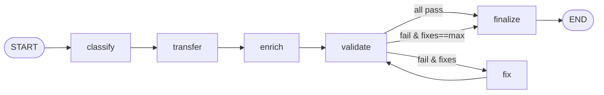

# Curator — LangGraph track

Turns a tool's documentation **source** into a **validated, fact-only clean section** (e.g.
`clean/install.yml`). The orchestration is a `StateGraph`: each pipeline stage is a node, and the
"keep fixing until it validates" loop is a **conditional cycle edge**. This is the whole point of the
rewrite — the loop the text skill had to self-enforce is now owned by the graph.

Code: `graph.py` (this folder). Stage logic is shared with the NOOA track in
`temp/curator/stages/steps.py`; only the wiring below is LangGraph-specific.

## The graph

```
          ┌──────────┐    ┌──────────┐    ┌────────┐    ┌──────────┐
 START ──▶ │ classify │──▶ │ transfer │──▶ │ enrich │──▶ │ validate │ ◀──────┐
          └──────────┘    └──────────┘    └────────┘    └────┬─────┘        │
                                                             │              │
                                                   _after_validate()        │
                                             ┌───────────────┴───────┐      │  fix → validate
                                   all checks │pass                   │      │  (the CYCLE)
                                              ▼                       ▼      │
                                        ┌──────────┐            ┌──────────┐ │
                                        │ finalize │            │   fix    │─┘
                                        └────┬─────┘            └──────────┘
                                             ▼                   (fixes < max_fixes?
                                            END                   else → finalize)
```

Mermaid (renders on GitHub-style viewers):



## State

`CuratorState` (a `TypedDict`) flows through every node; each node returns a partial dict that
LangGraph merges. Keys:

| key | set by | meaning |
|---|---|---|
| `task` | caller | the `SectionTask` (tool, section, source_text, example, ctx) |
| `providers` | caller | `{transfer, enrich, fix}` LLM providers (per-role) |
| `max_fixes` | caller | fix-attempt budget (default 2) |
| `tool_type` | classify | `single_command` / `aggregator` / `index_builder` |
| `obj` | transfer, fix | the pydantic section object being built |
| `results` | validate | `list[CheckResult]` from the last validation |
| `fixes` | classify(=0), fix(+1) | how many repair attempts have run |
| `status` | finalize | `valid` \| `unresolved` |

State lives in one explicit bag — the defining LangGraph trait (contrast: NOOA keeps it in local
variables / on the agent).

## The nodes (each just calls a shared stage)

1. **`classify`** (`_classify`) → sets `tool_type` (from `classify()`) and initializes `fixes = 0`.
   R0 from the skill: decides the tool's shape so section variants can differ later.
2. **`transfer`** (`_transfer`) → `obj = transfer(task, providers.transfer)`. **S1 source-transfer**:
   the LLM fills the section's typed pydantic schema *from the source only* (no fabrication). Because
   the return type is the schema, the object is structurally valid the moment it exists.
3. **`enrich`** (`_enrich`) → `obj = enrich(...)`. **S5**: best-effort, adds one source-backed note
   if the section supports notes and has none. Never fails the run.
4. **`validate`** (`_validate`) → `results = validate(task, obj)`. Runs the schema gate + global
   `no_render_tokens` + section checks (`temp/curator/validators/framework.py`). Deterministic;
   returns typed pass/fail with a stable `code` (e.g. `VERSION_DRIFT`, `SRC_MISS`, `BAD_FENCE`).
5. **`fix`** (`_fix`) → re-fills the schema, telling the model *exactly which checks failed and why*,
   then increments `fixes`. This is a **targeted repair**, not a blind re-roll.
6. **`finalize`** (`_finalize`) → sets `status = valid` iff every check passed, else `unresolved`.

## The loop, in detail

The cycle is a single **conditional edge** out of `validate`, decided by `_after_validate(state)`:

```python
def _after_validate(s):
    if finalize(s["results"]):                 # every check passed
        return "finalize"                      # → done, status=valid
    return "fix" if s["fixes"] < s["max_fixes"] else "finalize"
```

and the edge `fix → validate` closes the loop. So the runtime path is:

```
validate ─ pass ──────────────▶ finalize (valid)
   │
   └─ fail ─┬─ fixes < max ──▶ fix ──▶ validate   (try again with the failures fed back)
            └─ fixes == max ─▶ finalize (unresolved)   ← the "right to give up" gate
```

Two exit conditions, both explicit:
- **Converged** — a validation pass has zero failures → `finalize` → `status=valid`.
- **Budget exhausted** — `fixes` reached `max_fixes` and it still fails → `finalize` →
  `status=unresolved`. The section is *not* written as if it were good; the caller sees it failed and
  which `code`s remained. (This is the analog of the harness's "right to refuse": the curator will not
  emit a section it could not make valid.)

Termination is guaranteed: every trip through `fix` increments `fixes`, and the edge stops routing to
`fix` once `fixes == max_fixes`. No infinite loops, no reliance on the model "deciding" to stop.

## Worked trace — the drift repair

Curating `install` from the stale prose (`version: 0.11.9`) with the true version `0.12.1` in
`task.ctx`:

```
classify   → tool_type=single_command, fixes=0
transfer   → obj.version = "0.11.9"           (faithfully extracted from the stale source)
enrich     → obj unchanged (already has notes)
validate   → [schema:pass, no_render_tokens:pass, methods:pass, no_fence:pass,
              install_version_parity:FAIL(VERSION_DRIFT: 0.11.9 != 0.12.1)]
_after_validate → fail, fixes(0) < max(2) → "fix"
fix        → re-fill, told "VERSION_DRIFT … authoritative version is '0.12.1'"; fixes=1
             obj.version = "0.12.1"
validate   → all pass
_after_validate → "finalize"
finalize   → status=valid
```

The observable result (from `run_m32.py`): `install … valid … fixes=1 … version=0.12.1`.

## Entry points

- `build_graph()` → a compiled graph.
- `curate_section(task, providers, max_fixes)` → runs one section, returns an `Outcome`.
- `curate_tool(tasks, providers)` → maps over a tool's sections.

## Why LangGraph here

The pipeline *is* a state machine with a cycle and a terminal gate, so the graph is a faithful,
inspectable representation: you can render it, and every transition is named. The cost is ceremony
(explicit state dict, node/edge registration) for what is otherwise a short linear flow with one
back-edge — see the NOOA track for the same behavior as ~12 lines of ordinary Python.
