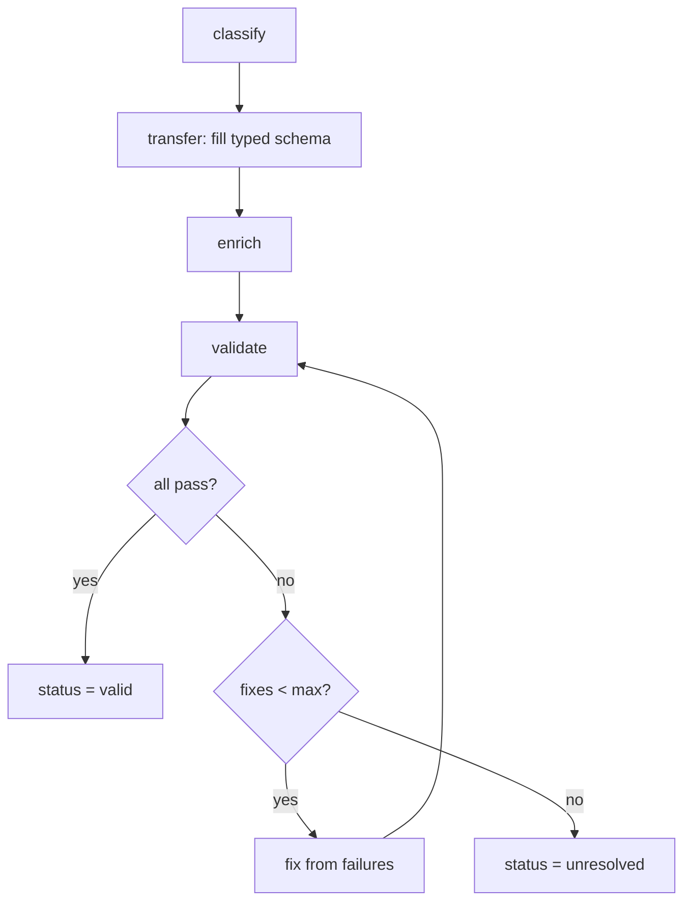

# Curator — NOOA track

Turns a tool's documentation **source** into a **validated, fact-only clean section** (e.g.
`clean/install.yml`). Same pipeline as the LangGraph track, but the orchestration is **ordinary
Python**: the "keep fixing until it validates" loop is a plain bounded `while`. This is NOOA's whole
thesis — control flow is just code, not a graph DSL.

Code: `orchestrator.py` (this folder). Stage logic is shared with the LangGraph track in
`temp/curator/stages/steps.py`; only the wiring below is NOOA-specific.

## The pipeline (as code)

```python
def curate_section(task, providers, max_fixes=2) -> Outcome:
    tool_type = classify(task.source_text)                 # R0  classify the tool's shape
    obj = transfer(task, providers["transfer"])            # S1  fill typed schema from source (no fabrication)
    obj = enrich(task, obj, providers["enrich"])           # S5  add a source-backed note (best-effort)

    results = validate(task, obj)                          # V   schema + global + section checks
    fixes = 0
    while not finalize(results) and fixes < max_fixes:     # ── the CYCLE ──
        failures = [r for r in results if not r.ok]
        obj = fix(task, obj, failures, providers["fix"])   #      targeted repair from the failures
        results = validate(task, obj)                      #      re-validate
        fixes += 1

    status = "valid" if finalize(results) else "unresolved"
    return Outcome(task.section, status, fixes, obj.model_dump(by_alias=True), results, tool_type)
```

Flow diagram:

```
 classify ─▶ transfer ─▶ enrich ─▶ validate ─┐
                                              │
                              ┌── while not passed and fixes < max ──┐
                              │                                      │
                              ▼                                      │
                       failures = fails                              │
                       obj = fix(...)                                │
                       results = validate(...)                       │
                       fixes += 1 ──────────────────────────────────┘
                              │
                       (loop exits) ─▶ status = valid | unresolved ─▶ Outcome
```



## State

There is **no state object**. State lives in local variables (`obj`, `results`, `fixes`,
`tool_type`) and — for a stateful agent — could live on the agent instance. This is the defining
contrast with the LangGraph track's explicit `CuratorState` TypedDict. Same information, different
home; the trade-off is no free snapshot/replay, but immediate readability and a normal debugger.

## The stages (each a shared pure function)

- **`classify(source_text)`** — R0: `single_command` / `aggregator` / `index_builder`. Decides the
  tool's shape so section variants can differ later.
- **`transfer(task, provider)`** — **S1 source-transfer**: the LLM fills the section's typed pydantic
  schema *from the source only*. The return type is the schema, so the object is structurally valid
  the instant it exists (fabrication of *structure* is impossible; fabrication of *facts* is caught by
  validation).
- **`enrich(task, obj, provider)`** — **S5**: best-effort, adds one source-backed note if the section
  supports notes and has none. Wrapped so any LLM error is swallowed — enrichment never breaks a run.
- **`validate(task, obj)`** — runs the schema gate + global `no_render_tokens` + section checks
  (`temp/curator/validators/framework.py`), returning typed pass/fail with a stable `code`.
- **`fix(task, obj, failures, provider)`** — re-fills the schema, telling the model *exactly which
  checks failed and why* (and the authoritative version, if drift). A **targeted repair**.
- **`finalize(results)`** — boolean gate: `True` iff every check passed.

## The loop, in detail

```python
results = validate(task, obj)
fixes = 0
while not finalize(results) and fixes < max_fixes:
    failures = [r for r in results if not r.ok]
    obj = fix(task, obj, failures, providers["fix"])
    results = validate(task, obj)
    fixes += 1
```

- **Guard 1 — `not finalize(results)`**: stop the moment a validation pass has zero failures.
- **Guard 2 — `fixes < max_fixes`**: a hard budget so a stubborn failure can't loop forever. Every
  iteration increments `fixes`, so the loop is guaranteed to terminate in ≤ `max_fixes` repairs.
- **`failures = [r for r in results if not r.ok]`**: only the *failing* checks are handed to `fix`, so
  the repair prompt is specific ("VERSION_DRIFT: 0.11.9 != 0.12.1"), not "try again".
- **Re-validate inside the loop**: the fix is never trusted; it must pass the same deterministic
  checks before the loop can exit.

Two outcomes, both explicit:
- **Converged** → `status = "valid"` (a pass had no failures).
- **Budget exhausted** → `status = "unresolved"`. The section is returned with its remaining failing
  `code`s; the caller does **not** treat it as good. (This is the curator's "right to give up" — the
  analog of the harness's right to refuse. It will not emit a section it couldn't make valid.)

## Worked trace — the drift repair

Curating `install` from the stale prose (`version: 0.11.9`) with the true `0.12.1` in `task.ctx`:

```
classify   → single_command
transfer   → obj.version = "0.11.9"        (faithful to the stale source)
enrich     → unchanged
validate   → install_version_parity FAIL (VERSION_DRIFT: 0.11.9 != 0.12.1)   → finalize()==False
while:  fixes=0 < 2
   failures = [VERSION_DRIFT]
   fix     → told the authoritative version is "0.12.1" → obj.version = "0.12.1"
   validate→ all pass
   fixes = 1
finalize() == True → loop exits
status = "valid"
```

Observable result (from `run_m32.py`): `install … valid … fixes=1 … version=0.12.1`.

## Entry points

- `curate_section(task, providers, max_fixes)` → runs one section, returns an `Outcome`.
- `curate_tool(tasks, providers)` → maps over a tool's sections.

## Why NOOA here

The pipeline is short and mostly linear with one back-edge; expressing it as ordinary Python (a
`while` loop over shared stage functions) is the most direct, debuggable form. The trade-off vs the
LangGraph track: no first-class, renderable graph object and no built-in state snapshotting — but far
less ceremony for the same behavior. Both tracks call the identical stage functions, so they produce
identical `Outcome`s (verified by `run_m32.py`'s parity check).
